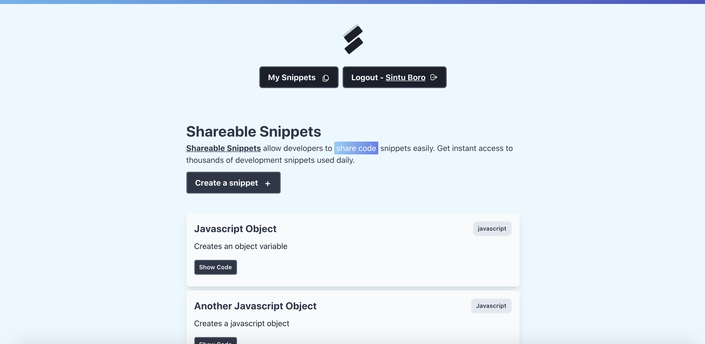

## Shareable Snippets

Share code snippets that you use frequently in development. Built with Auth0, Tailwind CSS, SWR, React Hook Form, and FaunaDB!

## Getting Started

1.  Create a Fauna DB account to get started with FaunaDB. Click [here](http://bit.ly/jqqfauna) to create an account. Please register a `FAUNA_SECRET` token that you would need to query the database.

2.  Also create a Auth0 account for authentication. Click here to get started with [Auth0.](http://bit.ly/jqqauth0).

3.  Setup Auth0 and store all the secrets in a `.env.local` file. Following are the secrets that you would require. Refer `.env.local.example` file.
    - **AUTH0_SECRET**: A long secret value used to encrypt the session cookie. You can generate a suitable string using openssl rand -hex 32 on the command line.
    - **AUTH0_BASE_URL**: The base URL of your application.
    - **AUTH0_ISSUER_BASE_URL**: The URL of your Auth0 tenant domain. If you are using a Custom Domain with Auth0, set this to the value of your Custom Domain instead of the value reflected in the "Settings" tab.
    - **AUTH0_CLIENT_ID**: Your Auth0 application's Client ID.
    - **AUTH0_CLIENT_SECRET**: Your Auth0 application's Client Secret.

## How to get started?

1. Clone the repo. `git clone https://github.com/Boro23-wq/Shareable-Snippets.git`
2. Install all the necessary dependencies by running `yarn` on the terminal.
3. Finally, run the dev server `yarn dev`.

---
